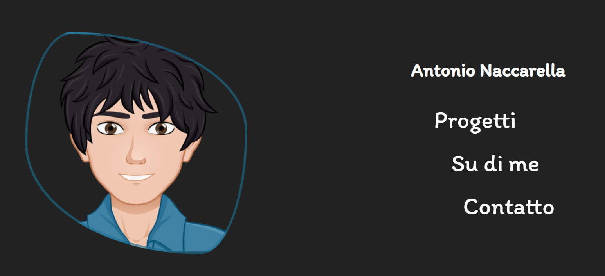

# Antonio Naccarella Portfolio

You can try here the app: [Link](https://antonionaccarella.netlify.app)

## Description

Project made for [Start2Impact Uiversity](https://www.start2impact.it/).
Personal site that talk about me, and it includes my best projects.

## :books: Lenguages and Tools

- HTML
- CSS
- Sass
- JavaScript
- Vite
- React
- React-router
- Axios

## :e-mail: Contacts

Get in touch

- [Linkedin](https://www.linkedin.com/in/antonio-naccarella-31976725a/)
- E-mail: naccarellaantonio25@gmail.com
